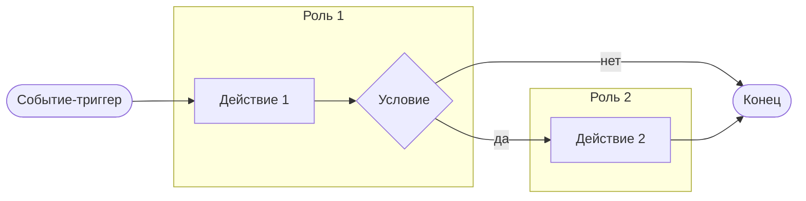

# Бизнес-процесс

Краткое описание процесса: что запускает, чем заканчивается, кто участвует.

## Схема

Черновая схема на Mermaid. Для нотации BPMN положите рядом файл `process.bpmn` из Camunda Modeler и сошлитесь на него.

## Описание шагов

| Шаг | Кто | Что происходит | Результат |
|---|---|---|---|
| 1 | | | |

## Исключения и альтернативные сценарии

-
