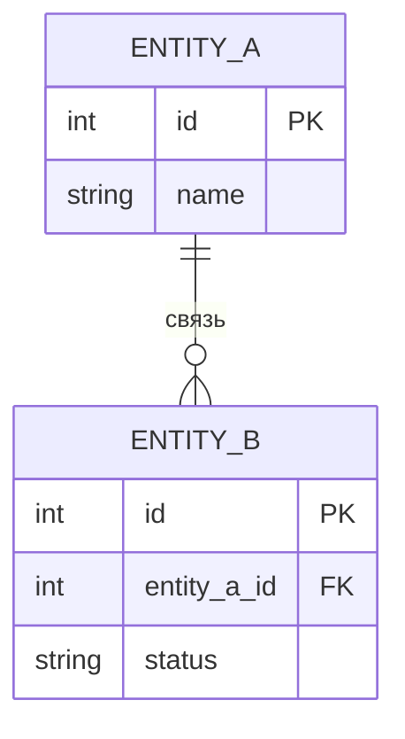

# Модель данных

## ER-диаграмма

## Описание сущностей

### ENTITY_A

| Атрибут | Тип | Обязательный | Описание |
|---|---|---|---|
| id | int | да | Идентификатор |

## Статусы и жизненный цикл

| Статус | Когда наступает | Куда можно перейти |
|---|---|---|
| | | |
