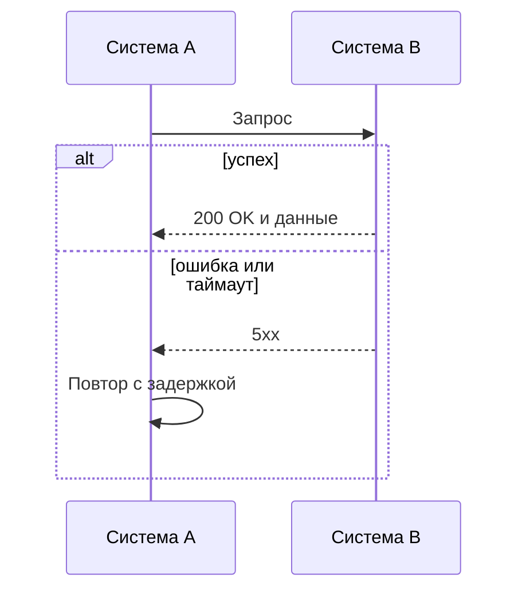

# Интеграция

Между какими системами идёт обмен и зачем.

## Поток обмена

## Формат данных

Протокол, формат сообщений, ссылка на [описание API](../api/openapi.yaml).

## Обработка сбоев

| Ситуация | Что делает система | Повторная отправка |
|---|---|---|
| Таймаут ответа | | |
| Ответ 5xx | | |
| Дубль сообщения | | |
| Некорректные данные | | |

## Требования к надёжности

-
